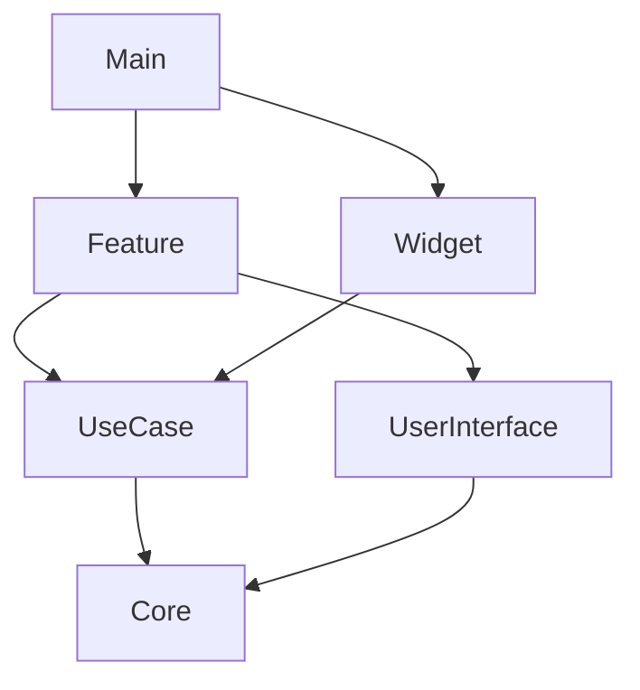

## ✨ 소개

)

**MyLaps**(가제)는 피트니스 트래킹 iOS 애플리케이션입니다. GPS 기반 실시간 트래킹부터 HealthKit 통합, 편리한 러닝을 위한 Siri Intent부터 위젯, Live Activity를 제공합니다.

**TestFlight** 설치필요.(외부 테스트)
https://testflight.apple.com/join/dF8jkty9

## 🎯 주요 기능

<table>
<tr width="100%">

### 🗺️ 실시간 GPS 트래킹
- 경로 추적
- 실시간 거리, 속도, 페이스 측정

</tr>
<tr width="100%">

### 📱 Live Activities
- 잠금 화면에서 실시간 상태 확인
- Dynamic Island 지원

</tr>
<tr width="100%">

### ❤️ HealthKit 통합
- Apple Health과의 연동
- 칼로리 자동 기록
- 건강 데이터 관리

</tr>
<tr width="100%">

### 🎙️ Siri 단축어
- "Siri야, MyLaps에서 기록시작 하자."
- 음성으로 간편하게 제어

</tr>
</table>


## 🛠 기술 스택

### 개발 환경
- **Language**: Swift 6.0
- **UI Framework**: SwiftUI
- **Architecture**: Clean Architecture, MVVM

### 사용 기술
```
SwiftUI | CoreData | Combine | Tuist 
HealthKit | MapKit | CloudKit
```


## 🏗 프로젝트 구조

```
MyLaps/
├── 📱 Main              # 앱 진입점
├── 🎨 Feature           # MVVM 구조의 앱 구성 요소 
├── 💡 UseCase           # 비즈니스 로직
├── 🔧 Core              # Extension, Protocol 등 유틸리티
├── 🎯 UserInterface     # 재사용 UI 컴포넌트
└── 🪟 Widget            # 홈 화면 위젯을 위한 Target
```


### 모듈 의존성


## 🚀 시작하기

### 요구사항
- Xcode 15.0+
- iOS 17.0+
- [Tuist](https://tuist.io) 4.34.3+

### 설치 및 실행

1. **저장소 클론**
```bash
git clone https://github.com/mgj0486/Laps-Portfolio.git
```

2. **mise 설치** (이미 설치되어 있다면 생략)
```bash
curl https://mise.run | sh
```

3. **mise 활성화 (shell 설정)**
```bash
echo 'eval "$(mise activate zsh)"' >> ~/.zshrc
  source ~/.zshrc
```

4. **Tuist 플러그인 추가**
```bash
mise plugins add tuist
```

5. **Tuist 설치**
```bash
mise install tuist@4.34.3
```

6. **Tuist 전역 설정**
```bash
mise global tuist@latest
```

6. **Tuist 전역 설정**
```bash
mise global tuist@latest
```

7. **Workspace 생성**(Laps-Portfolio 경로에서)
```bash
tuist generate
```

## 👨‍💻 개발자

**정문규**
- GitHub: [@mgj0486](https://github.com/mgj0486)
- Email: jungmk9525@gmail.com

---
