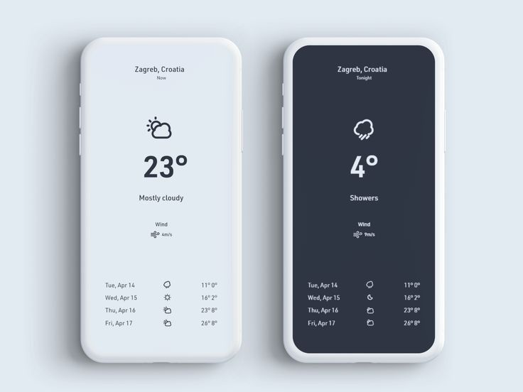
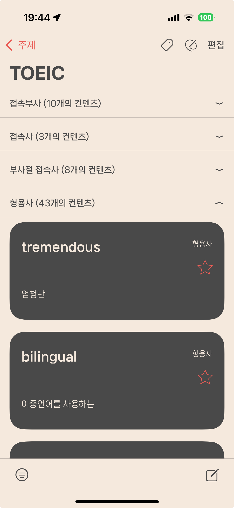
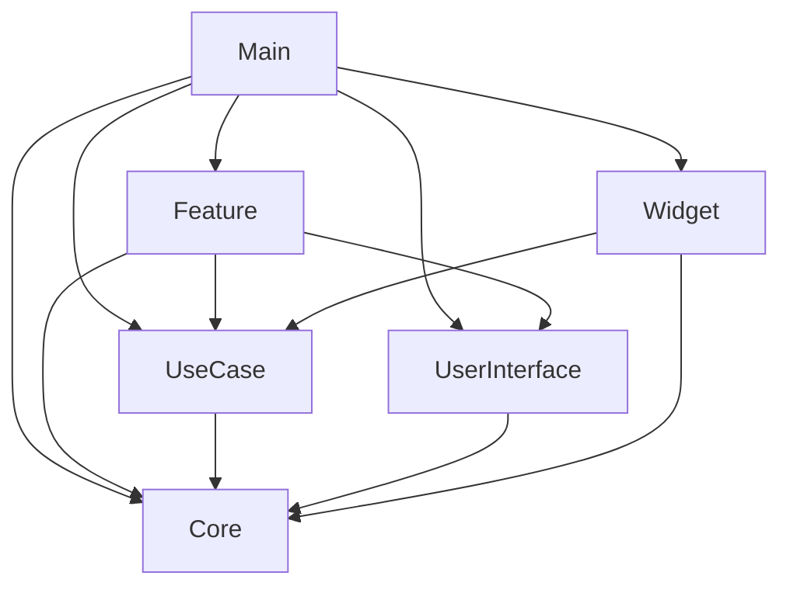

<div align="center">
  
# 🏃‍♂️ MyLaps

### 당신의 러닝을 더 스마트하게
  
[](https://swift.org)
[](https://developer.apple.com/ios/)
[](https://developer.apple.com/xcode/swiftui/)
[](LICENSE)

<p align="center">
  
  
</p>

[](https://apps.apple.com/app/mylaps)

</div>

## ✨ 소개

**MyLaps**는 러너를 위한 종합적인 피트니스 트래킹 iOS 애플리케이션입니다. GPS 기반 실시간 트래킹부터 HealthKit 통합, Live Activities까지 - 당신의 러닝 경험을 한 단계 업그레이드합니다.

## 🎯 주요 기능

<table>
<tr>
<td width="50%">

### 🗺️ 실시간 GPS 트래킹
- 정확한 경로 추적
- 실시간 거리, 속도, 페이스 측정
- 고도 변화 기록

</td>
<td width="50%">

### 📱 Live Activities
- 잠금 화면에서 실시간 상태 확인
- Dynamic Island 지원
- 한눈에 보는 러닝 정보

</td>
</tr>
<tr>
<td width="50%">

### ❤️ HealthKit 통합
- Apple Health와 완벽 연동
- 칼로리, 심박수 자동 기록
- 종합적인 건강 데이터 관리

</td>
<td width="50%">

### 🎙️ Siri 단축어
- "Hey Siri, 러닝 시작해줘"
- 음성으로 간편하게 제어
- 핸즈프리 러닝 경험

</td>
</tr>
</table>

### 🌟 추가 기능

- **🪟 홈 화면 위젯** - 빠른 시작과 최근 활동 요약
- **📊 패턴 감지** - 자주 달리는 코스 자동 인식
- **💾 오프라인 지원** - 인터넷 없이도 모든 기능 사용 가능
- **🌏 한국어 지원** - 완벽한 현지화

## 🛠 기술 스택

### 개발 환경
- **Language**: Swift 6.0
- **UI Framework**: SwiftUI
- **Minimum iOS**: 17.0+
- **Architecture**: Modular Architecture with Tuist
- **Database**: Core Data
- **Testing**: XCTest

### 사용 기술
```
SwiftUI | Core Data | HealthKit | MapKit | Core Location
WidgetKit | ActivityKit | Siri Intents | Combine
```

## 🏗 프로젝트 구조

```
MyLaps/
├── 📱 Main              # 앱 진입점, 라이프사이클
├── 🎨 Feature           # UI 컴포넌트, ViewModels
├── 💡 UseCase           # 비즈니스 로직
├── 🔧 Core              # 공통 유틸리티
├── 🎯 UserInterface     # 재사용 UI 컴포넌트
└── 🪟 Widget            # 홈 화면 위젯
```

### 모듈 의존성


## 🚀 시작하기

### 요구사항
- Xcode 15.0+
- iOS 17.0+
- [Tuist](https://tuist.io) 4.0+

### 설치 및 실행

1. **저장소 클론**
```bash
git clone https://github.com/yourusername/MyLaps.git
cd MyLaps
```

2. **Tuist 설치** (이미 설치되어 있다면 생략)
```bash
curl -Ls https://install.tuist.io | bash
```

3. **프로젝트 생성**
```bash
tuist generate
```

4. **실행**
```bash
./run-ios.sh
# 또는 Xcode에서 Main scheme 선택 후 실행
```

## 🧪 테스트

```bash
# Feature 모듈 테스트
xcodebuild test -scheme FeatureTest -destination 'platform=iOS Simulator,name=iPhone 15'

# UseCase 모듈 테스트  
xcodebuild test -scheme UsecaseTest -destination 'platform=iOS Simulator,name=iPhone 15'
```

## 📋 권한 설정

MyLaps는 다음 권한을 요청합니다:

| 권한 | 용도 |
|------|------|
| 🏃‍♂️ **Motion & Fitness** | 활동 데이터 수집 |
| 📍 **위치 (항상/사용 중)** | GPS 트래킹 |
| ❤️ **HealthKit** | 건강 데이터 연동 |
| 🔔 **알림** | 러닝 알림 |

## 🤝 기여하기

프로젝트 개선에 기여해주세요!

1. Fork the Project
2. Create your Feature Branch (`git checkout -b feature/AmazingFeature`)
3. Commit your Changes (`git commit -m 'Add some AmazingFeature'`)
4. Push to the Branch (`git push origin feature/AmazingFeature`)
5. Open a Pull Request

## 📝 라이선스

이 프로젝트는 MIT 라이선스 하에 배포됩니다. 자세한 내용은 [LICENSE](LICENSE) 파일을 참조하세요.

## 👨‍💻 개발자

**Moon Kyu Jung**
- GitHub: [@moonkyujung](https://github.com/moonkyujung)
- Email: your.email@example.com

---

<div align="center">
  
**[⬆ 맨 위로 돌아가기](#-mylaps)**

Made with ❤️ in Korea

</div>